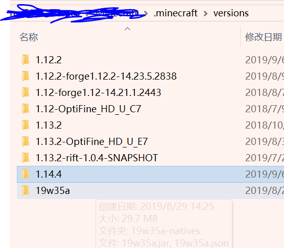
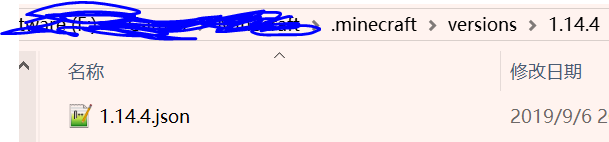
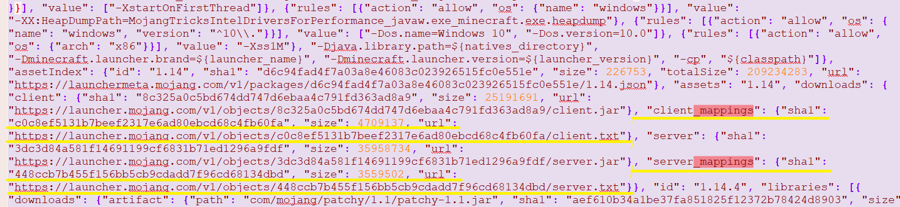

HMCL对1.14.4+紧急修复

手动操作还是能够救一下的

1. 在`.minecraft/versions/`下新建一个名字是`1.14.4`的文件夹

   

2. 手动下载[1.14.4的version manifest json](https://launchermeta.mojang.com/v1/packages/74b5fb5fa9ec7b14abe60b468e40703cfbf8d10e/1.14.4.json)到这个文件夹

   

3. 定位`client_mappings`和`server_mappings`两个字段并删除，就是删除下图中黄线部分（注意逗号和大括号的包含）*因为Mojang在19w36a宣布公开混淆表(url)到version manifest json，然后这两个字段就多出来了，然后HMCL就炸了*

   

   **也可以直接下载我这边改好的 [1.14.4.json](1.14.4.json) **

4. 打开HMCL，这时候1.14.4版本已经存在在在游戏列表啦！这个时候可以点击运行，HMCL会自动下载好剩下的文件。

然后如果要安装Fabric要下载[HMCL 开发版 3.2.134](https://ci.huangyuhui.net/job/HMCL/134/artifact/HMCL/build/libs/HMCL-3.2.134.jar)